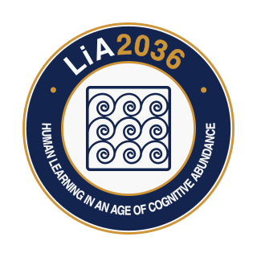

<div align="center">



# LiA2036

### Human Learning in an Age of Cognitive Abundance

**An AgenticHorizon AI Research Initiative**

An open scholarly initiative examining human capability, learning experience, and educational institutions as advanced cognitive assistance becomes abundant.

[Website](https://lia2036.agentichorizon.ai) &middot; [Manifesto](#manifesto) &middot; [Research](#research-architecture) &middot; [Publications](#publications) &middot; [Contact](#contact)


</div>

---

## About LiA2036

LiA2036—**Learning in Abundance 2036**—begins with a foundational question:

> **What should humans remain capable of doing when intelligent systems can do more?**

Advanced generative and agentic systems can increasingly explain, synthesize, calculate, generate, critique, translate, code, plan, and coordinate complex work. This does not make human knowledge obsolete. It changes the educational design problem.

LiA2036 investigates:

- which capabilities people should continue to learn and retain;
- which capabilities may be strengthened through human–AI collaboration;
- which forms of work require meaningful human supervision;
- which activities may responsibly be delegated;
- what learning experiences remain developmentally necessary;
- what evidence can support credible claims of human capability; and
- what institutions must become when learning is lifelong, AI-mediated, and distributed across contexts.

The initiative is not a prediction of one educational future and does not prescribe a universal curriculum. It develops an inspectable research architecture that researchers, educators, institutions, domain experts, and affected communities can examine, criticize, test, and extend.

LiA2036 is a **research initiative**, not a commercial software product, school, or book-support website.

## Current status

LiA2036 is in its **initial public research phase**.

- The foundational conceptual paper, *Education After Cognitive Scarcity*, establishes the initial integrated framework.
- The three-volume research program exists in manuscript form and is being prepared for designated public release.
- The public research website is being established at [lia2036.agentichorizon.ai](https://lia2036.agentichorizon.ai).
- A versioned Concept Atlas is in private prototype.
- Domain profiles, empirical studies, reference implementations, schemas, and institutional collaborations are planned research work.
- Proposed constructs and future programs must not be interpreted as completed, universally applicable, or empirically validated merely because they appear in the framework.

## Manifesto

Education was designed for a world in which high-level cognitive assistance was scarce.

That condition is changing.

When intelligent systems can participate across much of an intellectual workflow, successful task completion is no longer sufficient evidence of what a person understands, can independently execute, can responsibly supervise, or can recover when systems fail.

The educational response cannot be limited to adopting new tools, prohibiting them, or maintaining a changing list of “uniquely human” skills. The deeper responsibility is to decide what forms of knowledge, judgment, agency, responsibility, resilience, participation, and human development must remain meaningfully available to people.

LiA2036 begins from ten commitments:

1. **Begin with human purpose.** Education must begin with what humans should remain capable of doing, not with what machines cannot yet do.
2. **Do not confuse performance with development.** A system's ability to perform a task does not determine whether learning that task still matters for human judgment, agency, or responsibility.
3. **Task completion is no longer sufficient evidence.** When powerful assistance is always available, successful output cannot by itself demonstrate what a learner understands or can independently do.
4. **Decide where capability must reside.** For every consequential capability, education should ask what must remain executable by the person, what may be distributed, and what can be delegated.
5. **Separate assistance from dependence.** Assistance availability and required human capability are different design decisions.
6. **Preserve productive friction.** Some struggle, uncertainty, practice, and reflection are conditions through which capability is formed.
7. **Teach more than tool use.** Learners must learn when to act independently, when to augment themselves, when to supervise systems, and when delegation is responsible.
8. **Make capability visible.** Educational evidence must distinguish what resides in the learner, what resides in external systems, and what emerges through their coordination.
9. **Redesign institutions around continuity.** Institutions must support capability across changing tools, roles, contexts, and stages of life.
10. **Keep the future open to human judgment.** Education under cognitive abundance must protect the capacities through which people can question systems, assume responsibility, and shape collective life.

## Research architecture

LiA2036 connects three levels of inquiry:

> **Capability → Experience → Institution**

### Capability

What should a person learn, retain, understand, supervise, or be able to recover?

### Experience

What activity, challenge, representation, social arrangement, intervention policy, and evidence condition can develop that capability when advanced assistance remains available?

### Institution

What governance, infrastructure, academic work, rights, credentials, and long-term relationships are required to sustain those experiences legitimately?

The trilogy supports these domains. It does not define the initiative. Research questions, constructs, evidence, methods, and institutional work connect the three levels.

## Core constructs

### 1. Cognitive Abundance

Cognitive Abundance describes a condition in which high-level cognitive assistance becomes broadly and persistently available. Access remains socially and institutionally uneven, and abundance does not imply universal reliability, equity, or legitimacy.

### 2. Human-Sovereign Capability

Human-Sovereign Capability is the normative criterion for deciding which capabilities people should remain meaningfully able to exercise even when intelligent systems can perform related tasks at higher average performance.

The criterion considers:

- epistemic judgment;
- agency and meaningful choice;
- responsibility and accountability;
- resilience when systems fail or become unavailable;
- developmental value; and
- civic, professional, creative, and relational participation.

It is not a fixed list of “uniquely human” skills. Its application depends on purpose, stakes, reversibility, failure consequences, and domain obligations.

### 3. Capability Residency

Capability Residency asks where effective capability resides in practice:

| Residency condition | Meaning |
|---|---|
| **Human-resident** | The person can execute the relevant cognitive work with sufficiently limited external assistance. |
| **System-resident** | Effective capability is primarily supplied by an external system or tool. |
| **Distributed** | Performance emerges through a deliberately structured relationship among people, systems, artifacts, workflows, and institutions. |

The framework distinguishes **demonstrated human residency** from **required human residency**. A **residency gap** exists when demonstrated human-resident capability falls below what a particular context requires.

### 4. Learn–Augment–Supervise–Delegate

This four-mode model turns capability decisions into educational and governance choices.

| Mode | Primary intention | Core evidence question |
|---|---|---|
| **Learn** | Develop substantial direct human capability. | Can the learner perform, explain, and transfer the capability under the required assistance conditions? |
| **Augment** | Preserve human reasoning while assistance extends performance. | Does the person remain an active reasoner whose performance is improved rather than replaced? |
| **Supervise** | Retain sufficient knowledge, judgment, and authority to direct and evaluate machine work. | Can the person detect failure, challenge output, set constraints, and justify decisions? |
| **Delegate** | Permit an external system to perform the activity under governed conditions. | Is delegation appropriate, transparent, reversible where necessary, and aligned with responsibility? |

These modes are not a maturity ladder or permanent labels for technologies. The appropriate relationship depends on developmental purpose, stakes, required capability residency, and evidence needs.

### 5. Productive Friction

Productive Friction is effort, ambiguity, delay, dialogue, repetition, generation, or challenge deliberately preserved because it serves a defined developmental mechanism.

The governing question is:

> **If this difficulty disappears, what human capability stops developing or becomes harder to observe?**

If no credible developmental answer exists, the friction may be waste rather than pedagogy.

### 6. Capability–Experience–Evidence Network

The Capability–Experience–Evidence Network connects educational intentions to enacted learning and defensible evidence:

> **Capability → Designed Experience → Enacted Experience → Evidence Episode → Capability Inference**

Intervention conditions, assistance configuration, provenance, versioning, and human review surround this chain. The purpose is not exhaustive surveillance. It is to ensure that consequential educational claims can be interpreted in relation to how work was actually produced.

### 7. Learning Continuity Architecture

Learning Continuity Architecture addresses development across courses, institutions, workplaces, communities, and life stages.

It distinguishes **developmental continuity** from unrestricted **record continuity**. Useful continuity should support future learning while protecting privacy, contextual integrity, correction, contestation, expiry, selective forgetting, and learner agency.

## Current research programs

| Program | Domain | Status |
|---|---|---|
| Capability Residency Profiles | Capability | Framework development |
| Assistance-Aware Assessment | Capability and evidence | Research agenda |
| Productive Friction | Experience | Framework development |
| Learning Continuity | Institution | Research agenda |
| Future Learning Institutions | Institution | In development |
| Concept Atlas | Cross-domain | Private prototype |

Status labels distinguish defined constructs and design synthesis from proposed, developing, piloted, or validated work.

## Foundational paper

### *Education After Cognitive Scarcity*

**A Capability–Experience–Institution Framework for Learning in the Age of Advanced AI**

**Author:** Ahmad Zaeri  
**Affiliation:** LiA2036, an AgenticHorizon AI Research Initiative  
**Initial version:** 2026

The paper presents the initial conceptual architecture. Its central derivation is:

> **Cognitive abundance → human-development requirements → capability architecture → experience architecture → institutional architecture**

The paper is a design synthesis grounded in established work on distributed cognition, cognitive offloading, human–automation interaction, learning science, formative assessment, learner modelling, AI governance, and lifelong learning. It does not claim that every component concept is new, that the framework has already been empirically validated, or that a single implementation can serve every domain.

### Suggested citation

```text
Zaeri, A. (2026). Education After Cognitive Scarcity: A Capability-Experience-Institution
Framework for Learning in the Age of Advanced AI. LiA2036, an AgenticHorizon AI
Research Initiative.
```

The archival DOI or final preprint URL will be added after the LiA2036 publication record is issued.

## Publications

### The LiA2036 trilogy

The initial research program is developed across three connected books:

1. **A New Philosophy of Learning**  
   *Education for the Age of Superintelligence*  
   Establishes the human-development and capability foundations.

2. **Rethinking Educational Media**  
   *Designing Learning for a Superintelligent World*  
   Examines how representations, interaction, assistance, evidence, and productive friction must be redesigned.

3. **Rebuilding Learning Ecosystems**  
   *Universities and Lifelong Learning in the Age of Superintelligence*  
   Extends the framework to universities, institutions, credentials, governance, and lifelong learning.

The books are foundational research outputs, not the organizing purpose of the initiative. Public files and release records should be taken only from designated LiA2036 releases.

## Research agenda

Priority areas include:

- domain-specific Human-Sovereign Capability profiles;
- methods for assessing demonstrated and required Capability Residency;
- studies of learning, retention, transfer, calibration, and recovery under different assistance conditions;
- intervention policies that preserve productive cognitive work without imposing unnecessary friction;
- assistance-aware assessment and evidence models;
- privacy-preserving continuity across learning contexts;
- governance patterns for provenance, human review, contestability, expiry, and selective forgetting;
- institutional designs for universities and lifelong-learning ecosystems; and
- open reference implementations that make assumptions and allocation decisions visible.

No universal numerical threshold, fixed ranking, or validated weighting is currently claimed for these constructs.

## Evidence discipline

Public LiA2036 materials should identify the kind and maturity of consequential claims:

| Label | Meaning |
|---|---|
| **Established evidence** | Findings supported by relevant published research. |
| **Design synthesis** | An integration of established ideas into a proposed architecture. |
| **Framework construct** | A defined conceptual tool proposed by LiA2036. |
| **Research proposition** | A claim stated so it can be challenged or tested. |
| **Pilot finding** | Early evidence with explicit scope and limitations. |
| **Validated finding** | A result supported by suitable replication and review. |

## Repository scope

This repository is the public entry point for LiA2036. The current release contains the initiative overview and approved research identity. Future designated releases may add:

| Path | Purpose |
|---|---|
| `README.md` | Project overview and public entry point |
| `brand/` | Approved public identity assets and usage guidance |
| `manifesto/` | Public manifesto and version history |
| `research/` | Research programs, propositions, and evidence-status records |
| `concepts/` | Versioned construct definitions and relationships |
| `publications/` | Approved publication records and archival links |
| `schemas/` | Future capability, evidence, and governance schemas |
| `examples/` | Future domain-specific applications and critiques |
| `docs/` | Contribution, governance, and editorial guidance |

The appearance of a future path in this map does not mean its contents are complete, public, or empirically validated.

## How to engage with the work

### Readers

Begin with the manifesto and foundational paper. Treat individual diagrams and constructs as parts of an integrated research architecture rather than as independent empirical models.

### Researchers

Use the framework to formulate domain-specific questions, hypotheses, operational definitions, competing models, and empirical tests. Distinguish established literature, LiA2036 design synthesis, empirical evidence, and your own extensions.

### Educators and institutions

Use the constructs as design questions rather than universal prescriptions. Capability allocations should be justified in relation to learner development, domain responsibility, stakes, reversibility, resilience, evidence requirements, and affected communities.

### Developers

Do not treat a conceptual diagram as a complete technical specification. Reference implementations should make assumptions, assistance conditions, provenance, human review, privacy boundaries, and failure modes explicit.

## Contribution status

The repository is in early public development. Substantive critique, domain analysis, replication proposals, and implementation questions are welcome when the repository's issue and discussion channels are enabled.

Before proposing a contribution:

1. identify whether it concerns a conceptual claim, empirical test, domain profile, implementation, governance rule, or editorial correction;
2. cite the relevant source or framework section;
3. state assumptions and assistance conditions explicitly;
4. avoid presenting normative synthesis as established empirical fact;
5. avoid universalizing conclusions from a single educational domain; and
6. do not include confidential learner, institutional, or proprietary data.

Formal contribution guidelines and a code of conduct will be published as the collaboration model develops.

## Epistemic and interpretive boundaries

Unless a designated release explicitly states otherwise, LiA2036 materials should not be interpreted as claiming:

- that advanced AI is universally accessible, reliable, equitable, or socially unconstrained;
- that human-resident capability is always preferable to distributed or system-resident capability;
- that increased assistance necessarily reduces learning;
- that one capability allocation applies across all domains and contexts;
- that the framework's constructs already have validated numerical measures;
- that contextual factors have universal quantitative weights;
- that implementation guarantees a particular educational outcome; or
- that the framework represents scholarly or institutional consensus.

LiA2036 is a design and research program. Its claims remain open to criticism, revision, domain-specific testing, and empirical evaluation.

## Organization, support, and disclosure

LiA2036 is an **open scholarly initiative supported and funded by AgenticHorizon AI**. It is presented as a research initiative, not as a commercial software product.

The foundational work is led by **Ahmad Zaeri**, founder and owner of AgenticHorizon AI. This relationship should be disclosed in scholarly submissions, presentations, and derivative public descriptions of the initiative. No external sponsor controls the initiative's research conclusions.

## Branding

LiA2036 uses the approved Research Seal identity and the exact AgenticHorizon AI nine-scroll symbol.

Approved primary colors:

| Color | Hex |
|---|---|
| Horizon Navy | `#13254E` |
| Horizon Gold | `#CE9435` |
| Warm White | `#F9F8F8` |

Do not redraw, simplify, reconnect, rotate, distort, or substitute the symbol. Use only approved assets and preserve their clear space, proportions, and minimum size.

## Rights and licensing

**Public availability is not the same as permission to reuse.**

Unless a specific file or directory carries an explicit license, all repository contents—including manuscripts, figures, diagrams, prompts, book materials, branding, and documentation—remain protected by copyright:

> **© 2026 AgenticHorizon AI Inc. All rights reserved.**

No license is granted by the absence of a `LICENSE` file. Do not copy, modify, redistribute, publish, sell, sublicense, train on, or create derivative works from repository content except where permitted by applicable law or by a written license attached to the relevant material.

Different artifact classes may later use different terms. A paper, source code, schema, dataset, and brand asset do not need to share the same license. Follow the rights notice attached to each artifact.

## Contact

**Ahmad Zaeri**  
LiA2036 · An AgenticHorizon AI Research Initiative  
[ahmadzaeri@agentichorizon.ai](mailto:ahmadzaeri@agentichorizon.ai)  
[lia2036.agentichorizon.ai](https://lia2036.agentichorizon.ai)

---

<div align="center">

**LiA2036 · Human Learning in an Age of Cognitive Abundance**

© 2026 AgenticHorizon AI Inc. All rights reserved.

</div>
